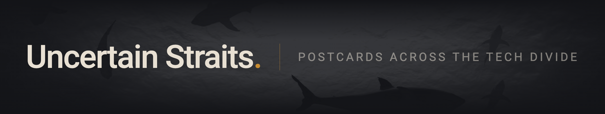

&nbsp;

'
01
`**About**

This is my personal GitHub - a workbench for side projects, experiments, and the occasional tool built out of necessity. Some of it might be useful to you, feel free to move on if it isn't.

&nbsp;

`02` — **Disclaimer**

Nothing here is affiliated with, endorsed by, or representative of my current or any other employer. These are personal projects, built in personal time.

&nbsp;

`03` — **Projects**

**[Mnemosyne](https://github.com/pabooth/mnemosyne)** &ensp; A technical content ingestion, categorisation and refining tool. Designed to improve and simplify technical documentation in line with the [Diataxis framework](https://diataxis.fr).

**[Subhoard](https://github.com/pabooth/subhoard)** &ensp; Extracts and archives Substack posts — public and paid - into email, markdown or PDF. Built for use in personal knowledge bases and offline reading.

&nbsp;

`04` — **Find me**

[LinkedIn ↗](https://www.linkedin.com/in/pabooth) 

[Blog ↗](https://grumpy.uk)

&nbsp;
<code>PGP · 9C1E 4FD8 7D75 6FEF BA0A  4590 E18C 2AE3 9BAE 3332</code>
